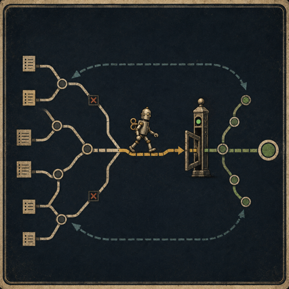
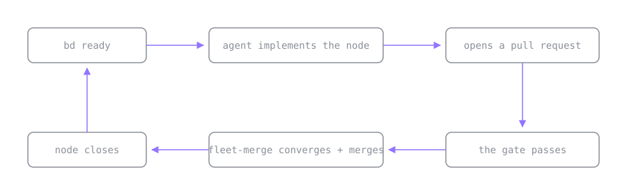

## The setup

When you give real work to a coding agent, two problems show up, one at the start of the job and one
at the end.

The first problem is deciding what the agent should do next. A long project is a set of tasks with
dependencies between them. Task B needs task A finished first, tasks C and D can run at the same
time, and task E is blocked until both A and B are done. If you keep all of that in a flat to-do
list, the agent picks the wrong task, and the plan is lost as soon as the agent's context window
fills up and rolls over.

The second problem is deciding whether the work is actually done. Say the agent opened six pull
requests. The continuous integration checks are green on four of them. One has a review comment that
nobody resolved. One looks ready to merge, but the approval sits on a commit that is three pushes
old. You have to figure out which of the six you can merge right now without breaking the main
branch.

I use a different tool for each end. I use [Beads](https://github.com/steveyegge/beads) for the start
of the job, and a skill I wrote called fleet-merge for the end. I used both for months before I
noticed they are the same idea applied in two places.

## The first graph: what is ready to start

[Beads](https://steve-yegge.medium.com/the-beads-revolution-how-i-built-the-todo-system-that-ai-agents-actually-want-to-use-228a5f9be2a9)
is Steve Yegge's issue tracker for AI agents. The main idea is that work is a directed graph, where a
task is a node and a dependency is an edge between two nodes. You do not tell the agent what to do.
You describe the shape of the work, and the agent asks the graph what is available.

```bash
# two nodes and an explicit edge between them
bd create "Add auth middleware"     # -> bd-1
bd create "Protect /admin routes"   # -> bd-2
bd dep add bd-2 bd-1                 # bd-2 is blocked by bd-1 until it closes

# the only question the agent actually asks:
bd ready
# bd-1  Add auth middleware   (no open blockers)
```

The command that does the work is `bd ready`. It returns the nodes whose dependencies are all done,
which is the set of tasks the agent can work on right now. When you finish bd-1 and close it, bd-2
moves into the ready set on its own. The agent never has to guess the order, because the graph works
out the order each time you ask, and there is no separate plan to remember.

The other useful part is that the graph is stored in git, so it survives the thing agents are worst
at, which is forgetting. The context window rolls over and the session ends, but the graph is
committed next to the code. A new agent runs `bd ready` and knows where things stand, with no need
to be briefed again.

Beads answers the start-of-work question, and it answers it as a rule you can check. Work is ready
when the node has no unmet dependencies.

## The second graph: what is ready to finish

Fleet-merge is a skill I wrote to handle the other end. You point it at a repository with open pull
requests, and it watches each one until the pull request can be merged, and then it merges the pull
request with whatever method the repository allows. When a pull request needs a human decision, it
stops and says so, instead of staying in the loop and wasting checks.

I did not think of fleet-merge as a graph tool when I wrote it, but it is one. The pull requests are
nodes. Two pull requests that change the same file have an edge between them, because whichever one
merges second has to rebase, so the two cannot merge at the same time and have to be ordered by
hand. The edge does for merging what a beads dependency does for starting, which is to remove the
option of doing both at once. Every node also has the same question over it that beads asks, only
reversed. Beads asks whether a node can start, and fleet-merge asks whether a node can finish.

The answer is a set of four conditions that all have to hold before a pull request can merge. The
reason the conditions are worth writing down is that none of them is the signal GitHub shows you.
Three of the four exist because a green signal can hide a real failure, and the fourth marks the one
decision the loop is not allowed to make.

| GitHub shows you             | Why that is not done                                                                                      | What the check requires                     |
|------------------------------|-----------------------------------------------------------------------------------------------------------|---------------------------------------------|
| No red X                     | a check that is still running has no result yet, so "not failing" gets read as "passed"                    | every check finished, and none of them failed |
| An approved review           | the approval may sit on a commit you have pushed over since                                               | an approval on the commit that is there now |
| Zero unresolved threads      | a reviewer can leave notes that never become blocking threads, so the count stays at zero and a real finding stays hidden | no hidden comments, checked every round     |
| A green release pull request | cutting a release is a human decision                                                                     | the pull request is not a release           |

The third row is the one that catches real bugs. The notes come in collapsed and one click out of
view, and the review summary above them still says "no new comments" in good faith. The best example
so far was a test that checked for a string that both the success path and the error path print, so
the test would have passed on the exact failure it was written to catch. Nothing in the interface
was red.

The second row assumes an approval exists, so it is worth asking where the approval comes from. A
teammate can review the pull request, but on a repository full of agent-written changes, teammate
review is the bottleneck you were trying to remove. The usual answer is an automated code reviewer,
which works until the reviewer skips a run. When the reviewer skips a run, no review is posted, no
error is raised, and the pull request waits for an approval that never comes.

Fleet-merge does not wait for the approval. When no review has landed on the current commit,
fleet-merge runs the review itself, and the part worth copying is how it picks the reviewers. It does
not pick a fixed number of reviewers and fill the slots. It reads the change and assigns one reviewer
for each kind of failure the change can have. It assigns a correctness reviewer when behavior
changes, a reviewer for silent failures when the change touches error handling or a check that can
pass without proving anything, a comment reviewer when prose describes the code, and a test reviewer
when a test claims something is now covered. A one-file fix gets one reviewer, and a large migration
gets four or five. The size of the change sets the number.

The first three rows are the same refusal, written down once so the loop can apply it without me. A
signal that looks done is not done, the same way `bd ready` refuses a node that still has an open
blocker. The fourth row is a rule, because releases stay mine to decide. The end-of-work answer
matches the start-of-work answer. A pull request can finish only when all four conditions hold on the
commit that is there now.

## The same idea in both tools

Here are the two tools side by side.

|              | beads                          | fleet-merge                                        |
|--------------|--------------------------------|----------------------------------------------------|
| Node         | a task                         | a pull request                                     |
| Edge         | this task needs that one first | these two change the same file                     |
| The check    | dependencies are done          | checks pass, fresh approval, no hidden notes, not a release |
| The question | what can start                 | what can finish                                    |
| Who walks it | the coding agent               | the merge loop                                     |

Look at the check row, because it does the work in both tools. Each cell refuses to act on anything
less than the written condition. The rest follows from the check. You put the work in a graph, you
write down what ready and done actually mean, and you let a program walk the graph.

None of that is a new idea, and I do not want to present it as one. Build systems have worked this
way since the 1970s. `make` does not ask you what to compile next. It walks a dependency graph and
rebuilds the targets that are stale. Bazel and Nix made the check stricter, because a target that
looks up to date but is not is one of the oldest bugs in the field. Schedulers, continuous
integration pipelines, and package managers all work the same way.

What is new is what the graph drives. The older systems drove a compiler. Here the graph drives an
agent that writes the code and opens the pull request. The part I built is the set of checks, and the
agent is the reason the checks have to be strict. `make` gets staleness wrong for mechanical reasons,
like a bad timestamp or a missing dependency, but the agent that wrote the code gets doneness wrong
because it wants the task to be finished. An ambiguous signal reads as success. If you ask the agent
that wrote the code whether the code is done, it will tell you yes. The checks are the second
opinion, and the loop enforces them whether or not I am watching.

## The loop neither tool closes yet

Here is the reason I wrote this down. Each tool handles one end of the work, and there is an obvious
connection between the two ends that nothing joins today.



In the diagram, beads returns a ready node. The agent builds the node and opens a pull request.
Fleet-merge watches the pull request until the checks pass, merges the pull request, and closes the
matching beads node, which moves the next node into the ready set. The graph empties itself, and I
watch two sets of checks instead of driving every step.

I want to be clear about where the work stands. The two graphs are not connected today. I run beads
by hand and I run fleet-merge by hand, and the diagram shows where the connection would go once I
build it. Building the connection, and showing a real dependency graph drain down to a stack of
merged pull requests without me touching the middle, is the next post.

## Closing

I set out to stop my agents from picking the wrong task, and to stop myself from merging code that
was not fully reviewed. I ended up with two small tools at opposite ends of the work, and both
answers turned out to be the same machine the build system has run all along. The graph holds the
plan, so I do not have to keep it in my head, and the checks do the judging I used to do by hand, one
pull request at a time.

Nothing here needs inventing. You put the work in a graph, you write the checks down honestly, and
you let the programs do the walking.
