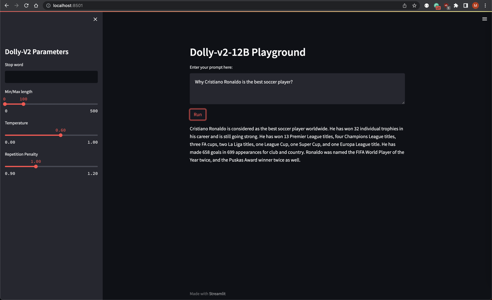

## Introduction

As the field of machine learning continues to evolve and make strides in its capabilities, it has become increasingly
important for organizations to develop robust practices for managing their machine learning workflows. MLOp has emerged
as a set of best practices and tools for managing the end-to-end lifecycle of machine learning models, from development
to deployment and beyond.

In this blog post, we will explore how MLOps practices can be leveraged to deploy a LLM in AWS SageMaker, leveraging the
popular Hugging Face Transformers library. We will dive into the details of setting up an end-to-end pipeline for
deploying a Language Model on SageMaker, including deployment, and monitor its performance over time.

By the end of this post, you will have a better understanding of the key components of an MLOps workflow, and how they
can be used to streamline the deployment of complex machine learning models in production environments. Whether you're
an experienced machine learning practitioner or just getting started, this post will provide valuable insights into the
cutting-edge tools and techniques that are driving the field forward.

## Getting Started

### Prerequisites - Runtimes

Install the following binaries on your machine:

```bash
brew install awscli
brew install go-task
brew install terraform
```

### Prerequisites - AWS Resources

Make sure your have an AWS account configured:

```bash
cat ~/.aws/config

aws_access_key_id = [REDACTED]
aws_secret_access_key = [REDACTED]
```

1. Clone the repo
    ```bash
    git clone https://github.com/eschizoid/secon-2023.git
    ```
2. Run Terraform init to check the provider loaded as expected
   ```bash
   task tf_init
   ```
3. Run Terraform Plan
   ```bash
   task tf_plan
   ```
4. Create SageMaker domain, user profile, and JupyterServer
   ```bash
   task tf_apply
   ```
5. Upload model to S3
   ```bash
   task tar_model
   task upload_model
   ```

## Provisioning JupyterServer

Once the infrastructure is up and running, you can access the JupyterServer by clicking the button "Open Studio" in the
SageMaker console:


## Deploying LLM - Dolly V2 12B

From the JupyterServer, you can import this git repo and reference the notebook `notebooks/deploy-to-sm-endpoint.ipynb`.

After importing the notebook into the JupyterServer, you can proceed to deeploy the model like the image below shows:

--- 
**NOTE**

It's important to mention that this step might take a couple of minutes to complete.

---


You can verify the model was deployed successfully by checking the SageMaker endpoint status on the AWS Console:


## Consuming SageMaker Endpoint

Inspired by the documentation on how to
use [TensorBoard in SM Studio](https://docs.aws.amazon.com/sagemaker/latest/dg/studio-tensorboard.html), we can use the
same mechanism to spin up a [Streamlit](https://streamlit.io) application.

To do so, just execute the following command:

```bash
task run_playground
```



You will be able to access the playground on: `https://localhost/8501/`

