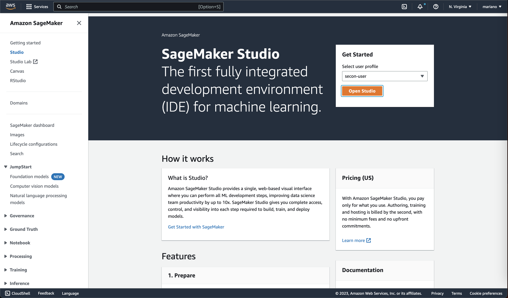
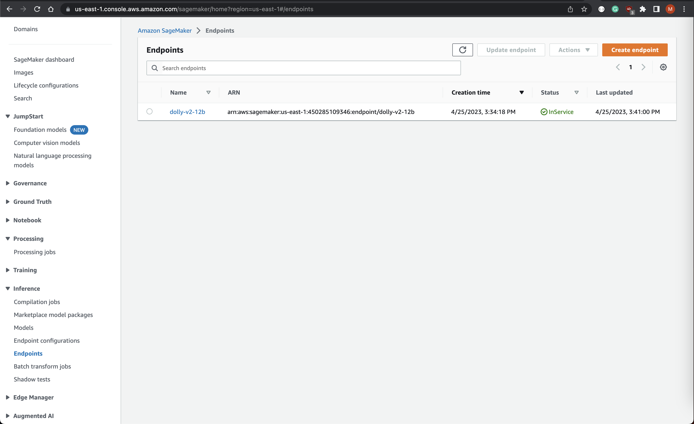

## Introduction

As the field of machine learning continues to evolve and make strides in its capabilities, it has become increasingly
important for organizations to develop robust practices for managing their machine-learning workflows. MLOp has emerged
as a set of best practices and tools for managing the end-to-end lifecycle of machine learning models, from development
to deployment and beyond.

In this blog post, we will explore how MLOps practices can be leveraged to deploy an LLM
in [AWS SageMaker](https://aws.amazon.com/sagemaker/) using the
popular [Hugging Face Transformers library](https://github.com/aws/sagemaker-huggingface-inference-toolkit). We will
dive into the details of setting up an end-to-end pipeline for deploying a Language Model on SageMaker and monitoring
its performance.

By the end of this post, you will have a better understanding of the key components of an MLOps workflow, and how they
can be used to streamline the deployment of complex machine learning models in production environments. Whether you're
an experienced machine learning practitioner or just getting started, this post will provide valuable insights into the
cutting-edge tools and techniques that are driving the field forward.

## Getting Started

### Prerequisites - Runtimes

Install the following binaries on your machine:

```bash
brew install awscli
brew install go-task
brew install terraform
```

### Prerequisites - AWS Resources

Make sure your have an AWS account configured:

```bash
cat ~/.aws/config

aws_access_key_id = [REDACTED]
aws_secret_access_key = [REDACTED]
```

1. Clone the repo:
    ```bash
    git clone https://github.com/eschizoid/secon-2023.git
    ```
2. Run terraform init to check the provider loaded as expected:
   ```bash
   task tf_init
   ```
3. Run terraform plan
   ```bash
   task tf_plan
   ```
4. Create SageMaker domain, user profile, and JupyterServer instance:
   ```bash
   task tf_apply
   ```

### Creating `mode.tar.gz` file

1. The first step is to create a folder structure like the following:
    ```bash
    model.tar.gz/
    |- model/code/
      |- inference.py
      |- requirements.txt   
    ```

2. Using the [SageMaker Hugging Face Inference Toolkit](https://github.com/aws/sagemaker-huggingface-inference-toolkit),
   we can reference [Dolly](https://huggingface.co/databricks/dolly-v2-12b) in SageMaker by creating a function like the
   one below in the file `inference.py`. By doing this we will be overwriting the `model_fn` function:

   ```python
   import torch
   from transformers import pipeline
   
   
   def model_fn(model_dir):
       instruct_pipeline = pipeline(
           model="databricks/dolly-v2-12b",
           torch_dtype=torch.bfloat16,
           trust_remote_code=True,
           device_map="auto",
           model_kwargs={"load_in_8bit": True},
       )
       return instruct_pipeline
   ```

3. Finally, upload model to S3:
   ```bash
   task tar_model
   task upload_model
   ```

## Provisioning JupyterServer

Once the infrastructure is up and running and the model reference has been uploaded to S3, you can access the
JupyterServer by clicking the button "Open Studio" in the SageMaker console:



## Deploying LLM - Dolly V2 12B

From the JupyterServer, you can import the [git](https://github.com/eschizoid/secon-2023) repo and reference the
notebook `notebooks/deploy-to-sm-endpoint.ipynb`.

After executing all the previous cells from the notebook, you can proceed to deploy the model like the image below
shows:


--- 
**NOTE**

It's important to mention that this step might take a couple of minutes to complete.

---

You can verify the model was deployed successfully by checking the SageMaker endpoint status on the AWS Console:



## Consuming SageMaker Endpoint

We can use the [Streamlit](https://streamlit.io) to create a fast application and test the model inference:

```python
import json

import boto3
import streamlit as st


def generate_text(input_prompt: str) -> str:
    payload = {
        "inputs": input_prompt,
        "min_length": min_length,
        "max_length": max_length,
        "temperature": temperature,
        "repetition_penalty": rep_penalty,
        "do_sample": temperature > 0,
    }

    response = sagemaker_runtime.invoke_endpoint(
        EndpointName=endpoint_name,
        ContentType="application/json",
        Body=json.dumps(payload)
    )

    result = json.loads(response["Body"].read().decode())
    return result[0]["generated_text"]


session = boto3.Session()
sagemaker_runtime = session.client("sagemaker-runtime", region_name=session.region_name)
endpoint_name = "dolly-v2-12b"

st.sidebar.title("Dolly-V2 Parameters")
stop_word = st.sidebar.text_input("Stop word")
min_length, max_length = st.sidebar.slider("Min/Max length", 0, 500, (0, 100))
temperature = st.sidebar.slider("Temperature", min_value=0.0, max_value=1.0, value=0.6)
rep_penalty = st.sidebar.slider("Repetition Penalty", min_value=0.9, max_value=1.2, value=1.0)

st.header("Dolly-v2-12B Playground")
prompt = st.text_area("Enter your prompt here:")

if st.button("Run"):
    generated_text = generate_text(prompt)
    if len(stop_word) > 0:
        generated_text = generated_text[:generated_text.rfind(stop_word)]
    st.write(generated_text)
```

And finally execute the following command to deploy using docker:

```bash
task run_playground
```


You will be able to access the playground on: `https://localhost/8501/`

### Cleaning up resources

To clean up the resources created by this project, you can run the following command:

```bash
task tf_destroy
```
