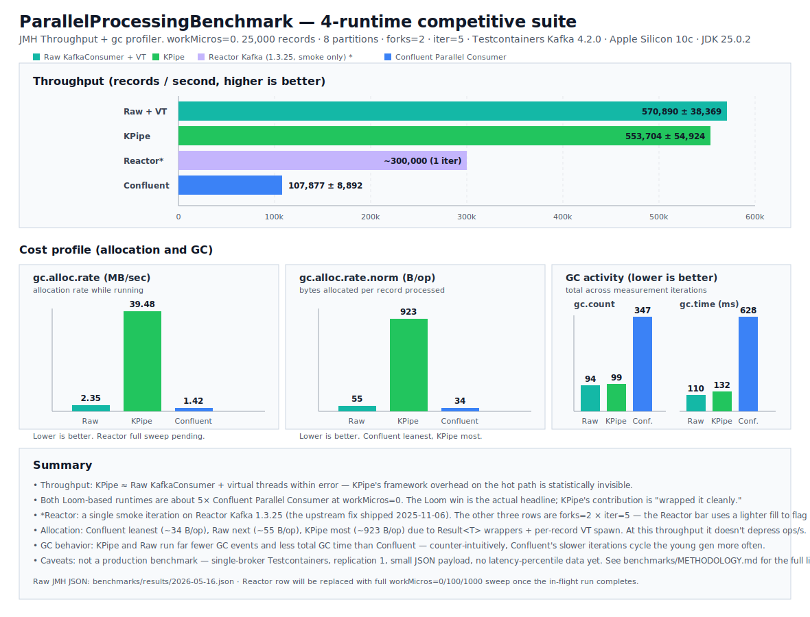

KPipe is a Java 25 Kafka consumer library that runs each record on a virtual thread. The pitch:
the performance of a hand-rolled `KafkaConsumer` + `Thread.ofVirtual()` loop, with the operational
stack already wired up — lowest-pending-offset commits, retry, DLQ producer, backpressure with
hysteresis, circuit breaker, OTel metrics + tracing, batch sinks, `Result<T>` typed pipeline
outcomes, graceful shutdown.

The question this post answers is what that pitch costs. KPipe is now benchmarked against three
alternatives: **Confluent Parallel Consumer**, **Reactor Kafka**, and a hand-rolled **raw
`KafkaConsumer` + virtual-thread executor** baseline. Three workload regimes, a real Kafka 4.2.0
broker via Testcontainers (not in-process), JMH-published scores with a GC profiler, and the raw
JSON committed alongside this post in [`benchmarks/results/`][bench-results].

**KPipe captures 85–95% of raw Loom throughput** and **degrades gracefully under blocking work**,
with about a 9% drop from 0 to 1000 µs of per-record I/O. Confluent drops 35% over the same sweep.
Reactor Kafka drops 96%. The rest of this post is the numbers, the methodology, and the saga of
getting Reactor onto the bench at all.

## Headline

Records / second, higher is better. `workMicros` is per-record simulated work via
`LockSupport.parkNanos`. 0 µs is pure framework overhead, 100 µs is local enrichment, and 1000 µs
is a blocking I/O round trip.
All four runtimes run against the same Testcontainers-managed Kafka 4.2.0 broker, same 25,000-record
seed, same eight partitions, two JMH forks × five measurement iterations.

| Runtime                         |       `workMicros=0` |     `workMicros=100` |     `workMicros=1000` |
|---------------------------------|---------------------:|---------------------:|----------------------:|
| **Raw `KafkaConsumer` + VT**    |     542,859 ± 34,077 |     500,231 ± 40,168 |      482,639 ± 50,406 |
| **KPipe**                       | **473,491 ± 79,218** | **461,273 ± 55,179** | **430,526 ± 117,613** |
| **Reactor Kafka 1.3.25**        |     256,648 ± 25,508 |       77,542 ± 1,054 |        **8,979 ± 34** |
| **Confluent Parallel Consumer** |     100,106 ± 19,160 |      108,194 ± 6,652 |        64,715 ± 3,091 |



## What 473,000 records/sec looks like to write

That throughput number is the fluent facade. End-to-end, including offset management, retry,
backpressure, and metrics:

```java
try (var handle = KPipe.json("orders", props)
    .pipe(order -> enrich(order))
    .filter(order -> order.total() > 0)
    .withRetry(3, Duration.ofMillis(100))
    .withBackpressure()
    .withDeadLetterTopic("orders.dlq")
    .toCustom(WarehouseSink.create())
    .start()) {
  handle.awaitShutdown();
}
```

Everything in the headline table for KPipe is this. No registry wiring, no manual builder, no
separate runner. The throughput cost of that ergonomics is what the rest of this post measures.

## What the numbers say

**KPipe degrades gracefully across the workload sweep.** 473k → 461k → 431k records/sec from
`workMicros=0` to `workMicros=1000`. About a 9% drop across a 1000× change in per-record work.
Virtual threads scale beyond the partition count, blocked records cost kilobytes of stack instead
of platform-thread slots, and the framework holds up under realistic I/O.

**You pay 5–15% throughput for the full feature stack.** Raw `KafkaConsumer + VT` is the fastest
runtime in the table at 543k for `workMicros=0` vs KPipe's 473k. That's the framework cost: ~13% at
zero work, ~8% at 100 µs, ~11% at 1000 µs. For that you get the lowest-pending-offset commits,
retry, DLQ, backpressure with hysteresis, circuit breaker, OTel metrics + tracing, batch sinks,
typed `Result<T>` pipeline outcomes, and graceful shutdown, all wired and tested. Building that
on top of the raw loop yourself is not a 10% project.

**Loom-based runtimes leave platform-thread libraries behind under load.** KPipe and Raw are
4.3×–7.5× ahead of Confluent Parallel Consumer across the sweep. Reactor Kafka tracks Confluent
at `workMicros=0` (257k), falls below it at `workMicros=100`, and collapses to **8,979 records/sec**
at `workMicros=1000`, 48× slower than KPipe. `Flux.parallel(100)` and a 100-worker thread pool
both hit a ceiling that virtual threads don't have. If your per-record work blocks (database
write, HTTP call, anything that parks), this is the gap KPipe is closing.

## Allocation and GC

KPipe allocates the most per record in the table and it didn't matter for this run's throughput.
The JVM young gen absorbed it cleanly. The number to watch is whether that holds on a tight heap
or under tail-latency-sensitive workloads. For steady-state throughput on a default heap, it's a
non-event.

| Runtime                     | `workMicros=0` B/op | `workMicros=100` B/op | `workMicros=1000` B/op |
|-----------------------------|--------------------:|----------------------:|-----------------------:|
| Confluent Parallel Consumer |                  34 |                    34 |                     35 |
| Raw `KafkaConsumer` + VT    |                  55 |                   431 |                    455 |
| Reactor Kafka               |                 175 |                    83 |                    193 |
| KPipe                       |                 924 |                 1,513 |                  1,436 |

KPipe's allocation comes from three places: `Result<T>` wrappers (sealed type, allocated per record),
the per-record pipeline builder hand-off, and a fresh virtual thread per record. The first two are
correctness choices — typed pipeline outcomes are how the consumer surfaces "passed / filtered /
failed" without overloading `null`, and they're the same mechanism that makes silent failures
impossible to ship. The third is the whole reason throughput holds up under blocking work.

The GC story is counter-intuitive but consistent. Confluent's smaller per-record allocations
still produce more total GC events than KPipe or Raw, because its slower iterations stay in the
young gen longer. Reactor's GC numbers at `workMicros=1000` look low (33 events / 98 ms) only
because the benchmark is barely running — at ~9 records/sec there's almost no allocation pressure
to clear.

## What this does not say

- **One payload shape, one broker config.** Small JSON, single-broker Testcontainers, replication
  factor 1. Production with a network broker and replication 3 / acks=all shifts the absolute
  numbers. Headline ordering between runtimes usually survives the move; the gaps shift.
- **No latency-percentile data yet.** `ParallelProcessingLatencyBenchmark` was not exercised in this
  run. Average throughput is half the story; p99 is the other half, and a runtime can rank one way
  on throughput and the opposite way on tail. Coming in the next snapshot.
- **The Loom share of the win is real.** Some of KPipe's lead over Confluent is "Loom beats platform
  threads," not "KPipe beats Confluent." The Raw column exists to make that share visible — KPipe's
  contribution is bringing Loom's win without losing the operational stack.

## How the harness got here

The first attempt at the new bench was wrong, and the wrongness was instructive.

**Attempt 1 — in-process Kafka via `KafkaClusterTestKit`.** Same approach as the prior 10k baseline.
Worked at 10k records, didn't scale. At 25k records with four invocation contexts loaded, the in-process
broker collapsed under load on a shared-core laptop — KRaft controller events, group coordinator,
producer seed, and consumer under test all fighting for the same CPUs. Smoke tests timed out at ~50
records/sec across every framework. **The bench was measuring broker contention, not framework
throughput.**

**Attempt 2 — Testcontainers Kafka.** Real Kafka 4.2.0 broker in a Docker container, on its own JVM
and own cores. Consumer is the bottleneck again. The same smoke test that got 50 records/sec on the
in-process harness now gets 500,000+ records/sec. That's not a 10x improvement — that's "measuring
the right thing now."

The lesson: **for parallel-consumer benchmarks, the broker has to be external.** Testcontainers is the
cheap path; a sidecar on dedicated hardware is the production-faithful path. In-process Kafka is fine
for "does my code compile and run end-to-end" tests. It is not fine for performance comparison.

## The Reactor Kafka saga

Getting Reactor onto the bench at all took two version bumps and a fat-jar exorcism.

Reactor Kafka 1.3.23 (the latest stable on Maven Central when I first set up the bench) **crashes on
first record** against `kafka-clients:4.x`:

```
java.lang.NoSuchMethodError: 'void org.apache.kafka.clients.consumer.ConsumerRecord.<init>(...)'
    at reactor.kafka.receiver.ReceiverRecord.<init>(ReceiverRecord.java:48)
```

The `ConsumerRecord` ctor `ReceiverRecord` calls was removed in kafka-clients 4.0. Issue
[#420](https://github.com/reactor/reactor-kafka/issues/420) on the upstream tracks this — opened March
2025, fix landed November 2025 as part of 1.3.25. The fix avoids the deprecated ctor in favour of one
that exists in both kafka-clients 3.x and 4.x.

Two gotchas worth recording:

- **Maven Central's search API was stale** when I checked. It returned 1.3.23 as the latest version
  even though 1.3.25 was already deployed. Always cross-check the direct directory listing
  (`https://repo1.maven.org/maven2/<groupId>/<artifactId>/`).
- **The fat JMH jar caches transitive bytecode.** After bumping `reactor-kafka` from 1.3.23 to 1.3.25
  in `libs.versions.toml`, the first smoke test still produced the old `NoSuchMethodError`. The fat
  jar had the 1.3.23 `ReceiverRecord.class` baked in. Force-cleaning fixed it:

  ```bash
  rm -rf benchmarks/build && ./gradlew :benchmarks:jmhJar --rerun-tasks
  ```

  Verified the right bytecode landed in the fresh jar with `javap -c -p`.

On 1.3.25 Reactor runs cleanly across the full sweep, which is how its row in the headline table
got populated.

## Reproduce locally

The bench code is on `main`:

```bash
just bench               # full 4-runtime publishing run, ~30–60 min on a quiet machine
just bench mode=smoke    # ~3–5 min KPipe-only sanity iteration
just bench mode=latency  # p50 / p95 / p99 / p999 companion
```

Output lands in `benchmarks/results/<date>.json` and `benchmarks/results/<date>.log`. The companion
human-readable summary template is in [`benchmarks/results/TEMPLATE.md`][template]. Methodology + the
runtime config matrix is in [`benchmarks/METHODOLOGY.md`][methodology]. **Docker must be running** —
Testcontainers will pull `apache/kafka:4.2.0` on first invocation.

## What's next

The next bench snapshot adds tail-latency percentiles (`p50 / p95 / p99 / p999`), a multi-partition
sweep, and a payload-size sweep. The committed JMH JSON in `benchmarks/results/` is the source of
truth; this post is the readable surface over it.

If you write Kafka consumers in Java and have been waiting for "Loom but with the operational stack
already there," KPipe is worth a look. The numbers above are the case for it.

[GitHub repo][gh] · [Benchmarks README][bench-readme] · [Raw JMH JSON][bench-results]

[gh]: https://github.com/eschizoid/kpipe

[bench-readme]: https://github.com/eschizoid/kpipe/tree/main/benchmarks

[bench-results]: https://github.com/eschizoid/kpipe/tree/main/benchmarks/results

[template]: https://github.com/eschizoid/kpipe/blob/main/benchmarks/results/TEMPLATE.md

[methodology]: https://github.com/eschizoid/kpipe/blob/main/benchmarks/METHODOLOGY.md
