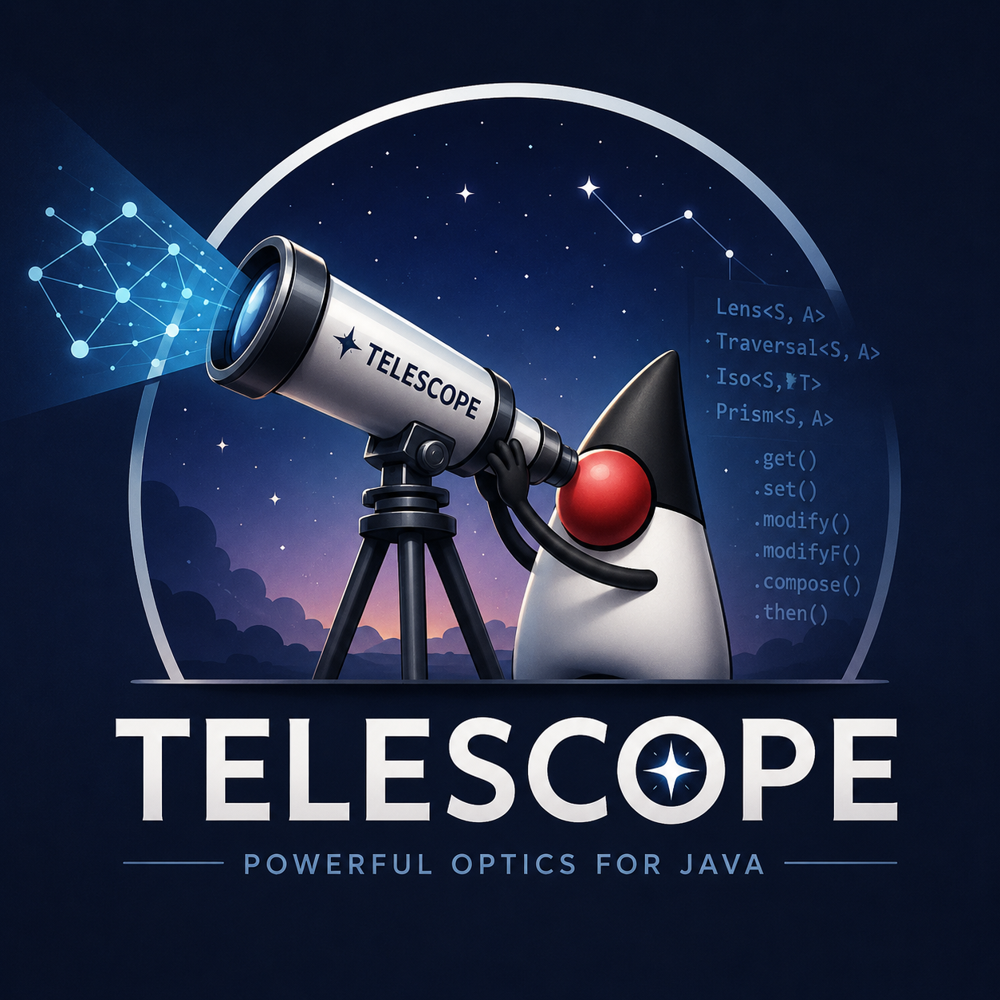

Telescope is a Java 25 deep-copy DSL for records and POJOs. You build a path through an immutable
graph, then read it, write it, update it, traverse it, convert it, or thread an effect through it.
No hand-written copy constructors. No mention of `Iso`, `Lens`, `Prism`, `Affine`, or `Traversal`
anywhere in your code. The end-state is one method-ref chain on the runtime DSL, or one fluent
chain on the generated navigator. Both bottom out at the same value:

```java
// Reflective (runtime resolution, ~262 ns/op for a 3-level path)
Telescope.of(Company.class)
  .each(Company::departments).each(Department::teams)
  .each(Team::users).field(User::email)
  .update(company, String::toLowerCase);

// Compile-time, reflection-free (~45 ns/op — same Telescope, generator-built)
CompanyPath.start()
  .departments().each().teams().each()
  .users().each().email()
  .update(company, String::toLowerCase);
```



It did not start there. The first commits were a small converter registry: function-based,
multi-hop composition, a few dozen lines. Two iterations later it had drifted into a full port of
Scala's Monocle library, eight category-theory interfaces
(`Iso`, `Lens`, `Prism`, `Affine`, `Traversal`, `Getter`, `Setter`, `Fold`) sitting on the public
API, a composition lattice picking the most-specific return type at every `.then(...)`, lens laws
verified in a test suite. Correct, complete, and unusable.

This post is how it got from there to the DSL above, with the codegen story that landed on top.
Some of it is also a record of how often I got the shape wrong and had to start over.

[GitHub repo][telescope]

## The optics itch and the slide into Monocle

The starting problem was concrete. Deep updates to immutable graphs in Java are ergonomically
awful. To change one field five levels down in `Company → Department → Team → User → Address`, you
write something like 25 lines of nested `new Company(company.name(), company.departments().stream()
.map(d -> new Department(...)))`, every constructor enumerated, every untouched field threaded
through by hand. Streams, `Optional`, and records made this cleaner than the pre-records version
but did not make it short.

My first attempt was a registry of named converters that composed in chains. It worked for the
synthetic test cases and then collapsed at the third level of nesting. Composition needed real
rules (what happens when you stack a partial-focus optic onto a many-focus one), and I was
reinventing those rules badly. So I went to the source.

Optics solve exactly this problem. A `Lens<S, A>` is two functions, a `get: S → A` and a
`set: S → A → S`, plus laws that keep the two consistent (`set(s, get(s)) == s`, and so on). A
`Prism` is the same trick for sealed-type cases. A `Traversal` generalises to many-focus.
Compositions between them form a lattice: stack a `Lens` and a `Prism` and you get an `Affine`,
stack an `Affine` and a `Traversal` and you get a `Traversal`. Decades-old rules, already proven,
already implemented in Haskell `lens`, Scala Monocle, Arrow Optics, Higher-Kinded-J.

Within two refactors of the converter registry, I had a working version of the lattice. The
test suite hit lens laws, prism partial round-trips, iso reversibility, and the diamond
resolution rule for `Iso.then(Lens)` returning `Lens`. The composition table:

| Outer ↘ Inner | Lens   | Prism  | Iso    | Affine | Traversal |
| ------------- | ------ | ------ | ------ | ------ | --------- |
| **Lens**      | Lens   | Affine | Lens   | Affine | Traversal |
| **Prism**     | Affine | Prism  | Prism  | Affine | Traversal |
| **Iso**       | Lens   | Prism  | Iso    | Affine | Traversal |
| **Affine**    | Affine | Affine | Affine | Affine | Traversal |
| **Traversal** | Trav.  | Trav.  | Trav.  | Trav.  | Traversal |

That table is intellectually satisfying. The lattice rules fall out of category theory and the
laws fall out of the type signatures. As a piece of academic Java, it was perfectly fine. As an
API anyone would actually use, it was unworkable.

## Why the academic shape hurt in Java

Monocle lives in Scala, and Scala has three things that make optics elegant:

- **Higher-kinded types.** A `Traversal[S, A]` in Monocle is defined as a function over any
  applicative `F[_]`. That's how `modifyF` (effectful update) drops out of the same definition
  as plain `modify`. In Java, `F[_]` does not exist.
- **Implicit type classes.** Scala's `cats` library makes "thread any applicative through a
  traversal" a one-line implicit lookup. Java has no implicits; every applicative would have to
  be passed explicitly.
- **Macros.** Monocle's `@Lenses` annotation generates per-field lens constants at compile
  time from a single annotation. Without macros, the choice is between writing the constants
  by hand or bolting on an annotation processor and a multi-module build.

Java has none of those, so the port surfaced every piece of the inheritance. Users had to import
`Lens`, `Prism`, `Iso`, and `Affine`, and know which composition produced which. They had to
remember that `Iso.then(Lens) = Lens` but `Lens.then(Prism) = Affine`. They had to think in
category-theoretic vocabulary to navigate a record.

That might fly in a Haskell library where the whole community has already opted in to the
vocabulary. It does not fly in Java. No team is going to learn five interfaces and a composition
lattice just to update a nested field, and I would not blame them.

So I tried to throw the lattice away.

## The detour that taught me what not to do

The next iteration replaced the eight interfaces with a single `Path<S, A>` class. `Path` had a
`Function<S, Stream<A>>` reader inside it, a hand-rolled `Updater<S, A>` for writes, and the
composition rules re-implemented from scratch as `Path` methods. The API surface collapsed to one
type. The lattice was gone.

This felt great for about two days.

Then I started adding the edge cases back. Iso reversibility, gone. Prism partial round-trip,
gone. The diamond resolution that made `Iso.then(Lens)` return `Lens` instead of widening to
`Affine`, gone. The lens laws were no longer verified by composition; they were now my problem to
enforce by hand inside `Path`'s update logic. The `Path` internals grew until they were a worse
version of the lattice I had just deleted.

The lattice, it turned out, was earning its keep. The fact that users did not want to see it did
not mean the implementation did not need it. What needed to go away was the exposure of the
lattice, not the lattice itself.

I reverted the deletion. The lattice came back into `org.telescope.internal.optics`,
package-private, where the compiler can enforce that nothing in user code ever names it. The
public surface became one class:

```java
public final class Telescope<S, A>
```

`Telescope` wraps a `Traversal<S, A>` from the internal lattice. Every navigation method (`field`,
`each`, `as`, `filter`) builds the appropriate optic and composes it via the lattice's rules.
Every read/write operation (`read`, `update`, `toList`, `set`, ...) delegates down. Users never
type `Lens`, `Prism`, `Iso`, `Affine`, `Traversal`, `Getter`, `Setter`, or `Fold` and have no
reason to learn what those words mean.

Two layers: proven concepts internally, convenient DSL externally. That is the shape that has
stuck through everything that came after.

## What the DSL looks like

The 30-second pitch is one path against a domain:

```java
record Address(String city, String zip) {}
record User(String name, int age, String email, Address address) {}
record Team(String name, List<User> users) {}
record Department(String name, List<Team> teams) {}
record Company(String name, List<Department> departments) {}

final Telescope<Company, String> emails = Telescope.of(Company.class)
  .each(Company::departments)
  .each(Department::teams)
  .each(Team::users)
  .field(User::email);

final Company lowered = emails.update(company, String::toLowerCase);
final List<String> all = emails.toList(company);
final long count = emails.count(company);
```

One path, built once, used many ways. The vanilla equivalent is about 25 lines of nested
`new Company(company.name(), company.departments().stream().map(d -> new Department(...)))`, every
constructor enumerated by hand, every untouched field threaded through.

Everything past that landed on the same substrate without changing it: sealed-type narrowing with
`.as(...)`, `Optional` traversal with `.whenPresent(...)`, indexed traversals, type conversion
between records via `from / to / using` and `map / to / field / build`, and the four effectful
update methods (`updateAsync`, `updateOptional`, `updateEither`, `updateValidated`). The
`Kind<F, A>` machinery that makes the four effects work lives in `internal.optics` and never
appears in user code.

## Then codegen happened, twice

The reflective DSL above resolves field names at runtime through
`SerializedLambda.getImplMethodName()` and `RecordComponent.getAccessor().invoke()`. It works, it
is sub-microsecond, and it is still reflection with all the costs that implies.

The first codegen pass shipped `@Focus` for records and `@BeanFocus` for POJOs. Annotate a type
and get a sibling class with per-field lens constants built from direct method-ref + canonical
constructor calls. No runtime reflection, no `SerializedLambda` decode, ~45 ns/op for a 3-level
field path. Container components got generated traversal constants alongside the field lenses, so
a `List<User> users` component on `Team` produced `TeamFocus.eachUsers : Telescope<Team, User>`,
and a fully compile-checked deep path looked like this:

```java
CompanyFocus.eachDepartments
  .then(DepartmentFocus.eachTeams)
  .then(TeamFocus.eachUsers)
  .then(UserFocus.email);
```

Type-checked at compile time, reflection-free at runtime. It also did not read like the
reflective DSL it was supposed to be the fast path for. The reflective version reads:

```java
Telescope.of(Company.class)
  .each(Company::departments).each(Department::teams)
  .each(Team::users).field(User::email);
```

The information content is the same, the reading flow is not. So the next pass replaced the
public lens constants with a fluent typed `Path` navigator:

```java
CompanyPath.start()
  .departments().each()
  .teams().each()
  .users().each()
  .email()
  .update(company, String::toLowerCase);
```

Per annotated type, `@Focus` now emits one parameterised navigator class (`<X>Path<R>`) plus one
container step per collection component (`<X><Cap>Step<R>`). Scalar components yield a terminal
`Telescope<R, T>`. Sub-record components yield a `<Sub>Path<R>` so navigation can keep going.
Container components (`List` / `Set` / `Iterable`, `Map` values, `Optional`) yield a step whose
`.each()` / `.eachValue()` / `.whenPresent()` returns the element's `Path` when the element type
is itself annotated, or a terminal `Telescope` when it is not. The method bodies all build
`Telescope.lens(getter, setter)` directly, with no reflection at any hop.

Every `Path` and `Step` also forwards the full `Telescope` operation surface (`read`, `find`,
`toList`, `count`, `exists`, `set`, `update`, `updateIndexed`, and the four effect variants), so
you do not have to terminate with `.get()` to operate at any hop:

```java
CompanyPath.start()
  .teams().each().users().each()
  .updateAsync(company, svc::lookupAsync, pool);   // CompletableFuture<Company>
```

The `@Bridge` annotation generates a bidirectional `Iso` between any two top-level types
(record↔record, record↔POJO, POJO↔POJO). When a type carries both `@Focus` and `@Bridge`, the
navigator gains an `as<Target>()` method that chains the bridge constant in:

```java
@Focus @Bridge(UserDto.class) record UserEntity(String id, String email) {}
@Focus record UserDto(String id, String email) {}

UserEntityPath.start()
  .asUserDto()
  .email()
  .update(entity, String::toLowerCase);
```

The Iso round-trips, so the result is a new `UserEntity`. The navigator is now one
compile-checked, reflection-free surface that covers navigation, container traversal, sync ops,
all four effects, and conversion. Cross-paradigm bridges (record↔POJO via `@Bridge`) work the
same way.

## Benchmarks

JMH, 3 warmup + 5 measurement iterations, JDK 25, Apple Silicon. Numbers shift between runs;
the ratios are the part to read.

| Benchmark                  | ns/op | ±error |             vs hand-copy |
| -------------------------- | ----: | -----: | -----------------------: |
| `bridgeForwardRead`        |  14.9 |   ±0.2 |       codegen conversion |
| `handRolledBeanCopyUpdate` |  22.2 |   ±0.6 |     1.0× (bean baseline) |
| `handRolledCopyUpdate`     |  26.4 |   ±1.9 |          record baseline |
| `lensConstantUpdate`       |  45.2 |   ±3.4 |                     1.7× |
| `fromBeanForwardRead`      | 114.0 |   ±1.7 |                     5.1× |
| `mapperForwardRead`        | 135.4 |  ±90.1 |    record→record (noisy) |
| `mapBeanForwardRead`       | 142.5 |   ±3.7 |                     6.4× |
| `reflectionFieldUpdate`    | 261.6 |  ±15.9 |                    11.8× |
| `ofBeanFieldUpdate`        | 488.1 | ±139.7 |                    22.0× |

A few things to read out of that:

- `@Bridge` codegen at ~15 ns/op vs runtime `mapBean` at ~142 ns/op is ~9.5× on the same POJO↔POJO
  conversion. That is the closest apples-to-apples comparison in the suite.
- Codegen field navigation at ~45 ns vs reflective at ~262 ns is ~5.8× on a 3-level deep field
  path. That is what `@Focus` → `*Path` buys.
- Runtime reflective conversions (`fromBean`, `mapper`, `mapBean`) cluster in the 114–142 ns
  range. Sub-microsecond, fine for ordinary use, not the path I would pick inside a tight loop.
- Native POJO navigation (`ofBean`) at ~488 ns is ~22× a hand-rolled bean copy. It rebuilds the
  whole POJO at every level and re-reads every getter to carry siblings over. For a hot loop,
  bridge once to a record with `fromBean` or use `@BeanFocus` codegen.

The codegen surface closes the 5–10× gap with hand-written code while keeping the same end-value
the reflective DSL produces. You pick a surface (reflective for ergonomics and zero codegen,
navigator for compile-time guarantees and the perf number) and you do not pay for the one you did
not pick.

## What still surprises me

A few things that have not stopped feeling notable after spending real time inside this codebase.

The lattice was right. The detour where I tried to delete it cost more lines than it saved, and
the "trust the proven implementation" lesson keeps coming back around. Having the lattice do the
work internally is why the DSL has not needed to expand its public surface to absorb effectful
update, codegen, or bridge hops. Each one landed as a handful of methods on `Telescope` plus
helpers in `internal.optics`, never a restructuring.

Codegen turned out to be a behaviour multiplier more than a perf trick. The first version of
`@Focus` was sold internally as "make `.field(...)` faster." The actual win was different: the
navigator makes paths *type-checked at javac*. A typo in `Company.teams` is now a compile error
instead of a runtime exception. The ~5.8× speedup is almost a side effect.

Bridge hops are probably the most underrated feature. A record's navigator can convert into its
DTO navigator in one fluent step, reflection-free, and the Iso round-trip handles the reverse for
free. I have not seen that in another Java lens library. It fell out of having `@Bridge` already
shipped: the codegen pattern is "if the source has both annotations, emit one extra method on the
`Path`." Two days of work for what genuinely feels like a step-change in ergonomics.

And the reflective DSL stayed honest. I expected it to feel obsolete once codegen landed, and it
has not. Anyone who wants to use telescope without wiring up an annotation processor still has the
full DSL, sub-microsecond, with build-time fail-fast validation that catches bad method refs at
path construction. Codegen is the opt-in that pays back in tight loops; the reflective path is the
default that just works.

Five rewrites in, the library is a single public type, a fluent generated navigator, four effect
variants, three styles of type conversion, and a benchmark suite that puts numbers on the
tradeoffs. Looking back, none of the rewrites felt obvious in advance. The one that mattered was
admitting the academic library was the wrong public surface and pushing it under the floorboards
twice: first behind `Telescope`, then behind the generated `*Path` navigators.

The category theory is still doing the work. You just do not have to know the vocabulary to use
it.

---

[GitHub repo][telescope]

[telescope]: https://github.com/eschizoid/telescope
