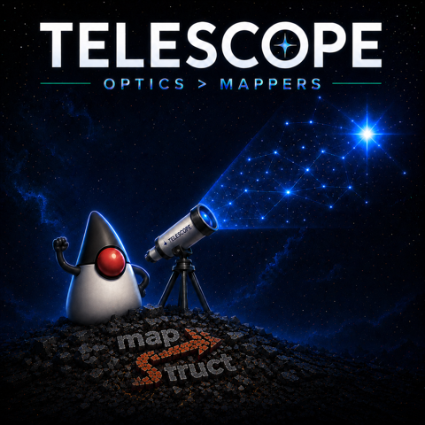

## The setup

Mapping one Java object to another is routine work in most apps, and
[MapStruct](https://mapstruct.org/), the standard tool for it, still has you name each field with a
string: `@Mapping(source = "customerName", target = "fullName")`. Those two names are what the whole
mapping turns on, and they are strings: rename the field and they stay exactly as they were.

MapStruct earned its place. Ten years, a huge adopter base, a bug list that converged long ago, and
it generates genuinely fast code; I reach for it too. Those strings are just the one piece of its
2014 design that aged badly.

[Telescope](https://github.com/eschizoid/telescope/) is the same job rebuilt on a foundation where
those field names are method references the compiler checks. This post is the honest comparison,
including the parts that do not favor telescope: the runtime numbers later are not flattering, and I
show them anyway. The pitch is narrow and I will not pad it. Your next mapper does not have to be a
wall of strings.

## The scorecard, up front

Two things to hold in your head before the details.

First, the capability gap, which is the actual reason to look. Most of the comparison is "telescope:
yes / MapStruct: not in scope." That asymmetry is the payoff of designing the whole thing in 2026
instead of 2014, not me stacking the deck.

| Capability                                               | telescope | MapStruct                   |
|----------------------------------------------------------|-----------|-----------------------------|
| Field names checked by the compiler                      | yes       | strings, unchecked          |
| Bidirectional from one definition                        | yes       | one direction per interface |
| Deep nested navigation + update                          | yes       | not in scope                |
| Effectful update (async / optional / either / validated) | yes       | not in scope                |
| Accumulating validation                                  | yes       | hand-rolled                 |
| Sealed-root dispatch                                     | yes       | not in scope                |
| Multi-source merge (N → 1)                               | yes       | yes, string-keyed           |
| Runtime path, no codegen                                 | yes       | compile-time only           |
| Maturity and ecosystem                                   | 1.0       | a decade                    |

Second, performance in one breath: at the codegen tier it is a tie at realistic depth, and the
reflective runtime path trades speed for needing no build setup. That is the whole perf story, and
the section below shows the numbers instead of asking you to take my word. The rest of the post is
what each row means at the call site.

## Two ways in: runtime or annotation processing

One thing shapes every example below. MapStruct has a single wiring model: annotation processing. You
add the processor to the build, write a `@Mapper` interface, and at compile time it generates a
`*Impl` class with the conversion inlined. That is the whole mechanism, and it is good.

Telescope gives you two. The runtime factory (`Telescope.mapper(A, B, ...)`, the form in the next few
sections) needs no annotation processor at all. It builds the mapping once when you construct
the mapper and dispatches through it on every call; you add a dependency, and you are done, nothing
wired into your build. The codegen path is the other one: annotate a type with `@Bridge` (or
`@Focus`) and telescope's processor emits the same kind of direct, inlined bytecode MapStruct does,
same compile-time mechanism, same performance class.

Keep that split in mind. The ergonomics gallery is a runtime API because that is what you reach for
first, and it asks nothing of your build. The annotations section after it is the codegen path, and
the performance section is where that path earns its keep.

## Your field names are strings. They should be references.

Here is the line that does the whole argument. A MapStruct field mapping:

```java
@Mapping(source = "customerName", target = "fullName")
```

Those are two string literals. MapStruct's processor checks them against the current field names, but
the type system never does, and a rename refactor walks straight past them. Delete a field and the
build fails, fine. But rename one of two same-typed fields and the string can silently rebind to the
wrong one: it compiles, it runs, it ships the wrong data. The same mapping in telescope:

```java
to(Order::getCustomerName, OrderDto::getFullName)
```

Two method references. Rename the getter, and the IDE renames this with it; miss one, and javac stops
the build. There is no string for a typo to hide in. That is the entire pitch, and it needs no
benchmark and no effect system: in 2026, the field names a mapper turns on
should be references the compiler and your IDE follow, and in MapStruct they are strings.

Everything else is downstream of that one decision. Once the path is a typed reference instead of a
string, the compiler can follow it deeper (nested updates), the library can run it backward off the
same definition (handy on the minority of mappers that actually need the inverse, though that is a
bonus, not the reason), and those references compose into validation and effects. But the
reason to switch fits on one line: stop writing your mappings as strings.

That is why I will say it plainly: telescope is the better-designed library. The rest of this post is
the receipts, including the ones that do not flatter it.

## The same mappers, side by side

Take the MapStruct calls you write every day and put the telescope version next to them. They look
alike on purpose; the difference is what the compiler can see. Every MapStruct row below turns on a
string literal; every telescope row turns on a method reference. (telescope rows are static-imported:
`to`, `via`, `constant`, `compute`, so the call site reads as a list.)

Rename a couple of fields, and the inverse:

```java
// MapStruct: and you still write toEntity() by hand for the way back
@Mapper
public interface OrderMapper {
  @Mapping(source = "customerName", target = "fullName")
  @Mapping(source = "createdAt", target = "createdDate")
  OrderDto toDto(Order order);
}
```

```java
// telescope: forward and backward off the one declaration
final var orders =
    Telescope.mapper(
        Order.class,
        OrderDto.class,
        to(Order::getCustomerName, OrderDto::getFullName),
        to(Order::getCreatedAt, OrderDto::getCreatedDate));

OrderDto dto = orders.forward(order);
Order back = orders.backward(dto); // no second interface
```

Land a flat source field on a nested target leaf:

```java
// MapStruct: the target path is a string
@Mapping(source = "customerName", target = "shipping.recipient.fullName")
CartDto toDto(Cart cart);
```

```java
// telescope: the codegen navigator is the argument; every hop is typed and refactors with you
Telescope.mapper(
    Cart.class,
    CartDto.class,
    to(Cart::customerName, CartDtoTelescope.of().shipping().recipient().fullName()));
```

Convert a single field's type:

```java
// MapStruct: a @Named method, wired in by string
@Mapping(source = "priceCents", target = "price", qualifiedByName = "centsToAmount")
ProductDto toDto(Product p);

@Named("centsToAmount")
static BigDecimal centsToAmount(long cents) {
  return BigDecimal.valueOf(cents, 2);
}
```

```java
// telescope: the converter and its inverse sit in the row
to(
    Product::priceCents,
    ProductDto::price,
    cents -> BigDecimal.valueOf(cents, 2),
    amount -> amount.movePointRight(2).longValueExact());
```

Stamp constants and per-call computed values:

```java
// MapStruct
@Mapping(target = "tenant", constant = "production")
@Mapping(target = "createdAt", expression = "java(java.time.Instant.now())")
OrderDto toDto(Order order);
```

```java
// telescope: same call, no expression-string escape hatch
Telescope.mapper(
    Order.class,
    OrderDto.class,
    to(Order::id, OrderDto::id),
    constant(OrderDto::tenant, "production"),
    compute(OrderDto::createdAt, Instant::now));
```

Update an existing target in place rather than building a new one:

```java
// MapStruct: @MappingTarget
void update(@MappingTarget OrderDto dto, Order order);
```

```java
// telescope: same idea, no annotation
OrderDto merged = orders.into(existingDto, order);
```

The pattern across all of these: the MapStruct side leans on annotation attributes and strings
(`target = "shipping.recipient.fullName"`, `qualifiedByName = "centsToAmount"`,
`expression = "java(...)"`), each of which is a string the type system never checks and a rename
refactor walks straight past. The telescope side is method references the compiler and the IDE
already understand, and the reverse direction is not a second artifact you maintain.

## When you want codegen: the `@Bridge` annotation

The gallery is the runtime path. When you want compile-time wiring and the last nanosecond, you
annotate instead. `@Bridge` is the answer to `@Mapper`, except it is one annotation on one type
rather than an interface you implement:

```java
@Bridge(OrderDto.class)
record Order(String id, String customerName, Instant createdAt) {}
```

That generates an `OrderBridge` with `BRIDGE_FN.forward(order)` and `.backward(dto)`. Both
directions, reflection-free, from the single annotation. Same-name fields wire themselves; you name
only what differs, and what differs goes in nested annotations that read like `@Mapping`, except the
processor checks every name and type against the real components at compile time:

```java
@Bridge(
    value = OrderDto.class,
    renames = {@Rename(source = "customerName", target = "fullName")},
    transforms = {@Transform(field = "priceCents", using = CentsToAmount.class)})
record Order(String customerName, long priceCents) {}
```

Then two attributes MapStruct has no equal for. First, `lenient`. By default `@Bridge` insists that
every field on both sides line up, so a round trip cannot silently lose one. That is the right
default most of the time and the wrong one for the small-DTO-into-large-entity shape: a seven-field
request mapping into a hundred-field entity where the other ninety-three are meant to stay at their
defaults. One flag turns the check off:

```java
@Bridge(value = GovtIdData.class, lenient = true)
record CustomerRequest(String referenceId, String policyNumber) {}
```

Second, the carrier form. A `@Mapper` interface can live in a third module that sees both sides;
`@Bridge` does the same by naming `source` and `target` explicitly, so neither model class has to
depend on the other:

```java
@Bridge(source = OrderEntity.class, target = OrderDto.class)
class OrderMapping {}
```

One annotation, two valid shapes: on the model when you own it, on a carrier when your module graph
will not let you. (`@Focus` is the sibling that generates the typed navigators, like the
`CartDtoTelescope` in the nested-target example above, for deep paths.)

## Mapping is one verb, not the whole library

The deeper difference: MapStruct maps, and that is the whole of it. Telescope
walks an immutable object graph, and mapping is one thing you do once you hold a path. The same path
that converts can read a nested value, update it, traverse a collection under it, or thread an effect
through it.

```java
Telescope.of(Company.class)
    .each(Company::departments)
    .field(Department::name)
    .update(company, String::toUpperCase); // upper-case every department name, deep and immutable
```

MapStruct cannot do that: it is a deep update of an immutable tree, and mapping is the only verb
MapStruct has. You never type `Lens` or `Traversal` to get it. The optic
lattice that makes the composition work stays inside the library, which was the entire point of the
rewrite I wrote up in [my previous post](https://mariano-gonzalez.com/posts/post-6/). Conversion is
just the terminal you reach for most.

## Accumulating validation, which MapStruct cannot express

The most underrated feature has nothing to do with speed. Turning a stringly-typed payload (a form
post, a JSON body) into a typed object means validating several fields at once. MapStruct maps; it
does not validate. Collecting every failure in one pass means bolting on an `@AfterMapping`
accumulator you own, or a separate validation library.

Telescope ships `Validated` as a first-class effect, so "build the target only if every field passes,
and report every failure in one pass" is a primitive:

```java
Validated<String, Account> account =
    Validated.combine(validateEmail(form.email()), validateAge(form.ageText()), Account::new);

// both bad fields surface at once:
// Invalid[email: missing '@' in 'not-an-email', age: out of range: 200]
```

`combine` accumulates: both checks run, and both errors survive, where `Either` would stop at the
first failure. `combineAll` does the batch version across a list of rows. This is the "switch your
mapper over and get validation for free" line, and it holds because it is a shipped API, not a roadmap
promise.

## The performance conversation, honestly

This is the section where "we beat the incumbent" posts tend to quietly cheat, so let me be precise
about what is being measured.

There are two performance questions and they have different answers. The first: codegen against
codegen. When telescope's `@Bridge` processor and MapStruct's `@Mapper` processor both emit compiled
bytecode for the same mapping, how do they compare? The second: telescope's reflective runtime path
against MapStruct's codegen. Those are different questions, and running them together is how you
end up with a headline that does not survive contact with someone else's profiler.

Codegen against codegen is a tie at any realistic depth. Both processors emit direct, JIT-inlinable
calls: method references and constructor invocations, no reflection on the hot path. Here is the
matrix, run on a dedicated GitHub Actions runner with no competing workload, so the error bands are
tight (±0.01 to 0.9 ns) rather than the ±20 ns a laptop hands you:

| Tier   | Direction     | MapStruct | Telescope `@Bridge` | Ratio |
|--------|---------------|----------:|--------------------:|------:|
| flat   | bean → record |   3.11 ns |             4.84 ns | 1.56× |
| nested | bean → record |   4.22 ns |             8.47 ns | 2.01× |
| deep   | bean → record |   46.4 ns |             53.4 ns | 1.15× |

Read the trend, not the worst row. On a trivial five-field flat struct, telescope pays about 1.7 ns
more per call, a few L1 hits, for a 1.56× ratio that only looks bad because the absolute numbers are
tiny. As the tree gets deeper and the per-call work grows, the fixed dispatch overhead amortizes
away: by the deep tier (three levels of nesting plus two list hops, the shape real code actually has)
it is 1.15×, a tie. The nested tier's 2.01× is the worst row in the table, and in absolute terms it
is four nanoseconds. If that is the bottleneck in your service, congratulations on the rest of your
stack.

Now the methodology aside, because it is the part those posts skip. Smoke runs lie. An early laptop
run told me telescope's zero-hop static path was *slower* than its own deeper lattice path, with
error bars larger than the mean, which is impossible. It turned out to be JMH escape-analysis noise
(the JIT was eliding an allocation inconsistently across iterations). The clean CI run dissolved it. I
do not trust a mapping microbenchmark that was not run on dedicated hardware at a real iteration
count, my own included, and neither should you. Run the workflow on your own box before you believe
any of these numbers.

Runtime against codegen is where the cost actually lives, and it is real. The reflective
`Telescope.mapper(...)` path (no annotation processor, the mapping resolved at runtime, a
structural-Iso chain dispatched on every call) lands at about 8× MapStruct on the deep-forward path
(381 ns against 46 ns). That is down from about 19× before a measured optimization pass: an
`Object[]` positional intermediate replacing a `LinkedHashMap`, and capturing each field's reader
once at assembly time instead of re-resolving it per call. The bean-building backward direction is
heavier still, closer to 19×, because allocating a POJO and calling N setters is more work than a
record's single canonical-constructor call.

That 8× buys something MapStruct cannot do at all: zero setup. No annotation processor, no build
wiring. Hand it two classes at runtime, and it resolves the mapping on the spot, where MapStruct is
codegen or nothing. "Telescope is 8× slower" is the misleading way to put it: MapStruct has no
runtime path at all, and telescope's costs 8× on deep forward. You are paying for a path MapStruct
does not offer, not losing a race you were both in. When you want the speed back, you put `@Bridge`
on the type, and you are in the codegen tier at parity: same library, same API, one annotation.
Nothing is given up permanently.

## Where MapStruct still wins, for now

Everything MapStruct beats telescope on comes down to time, not design.

Maturity is the big one. A decade across thousands of codebases means the edge cases are found and
the answers are written down, where telescope is at 1.0 and some of those edges are still mine to
find. The ecosystem is the quieter one: IDE support, a Stack Overflow answer for every question, and
the next engineer on the team already knowing it and never having heard of this. That is a real
switching cost, and I will not pretend otherwise.

Now notice what is not on that list. Nothing about the architecture, the type safety, the capability
surface, or the codegen speed. MapStruct wins on age and adoption, the two things a newer library
gets only by shipping and waiting, and the two things that tell you nothing about which design is
better. So I am not going to tell you to rip out working mappers; replacing code that works is a bad
trade no matter what you would replace it with. I am going to tell you the inexpensive thing instead:
the next mapper you write, write it in telescope.

## When to pick which

Reach for MapStruct when the codebase is already MapStruct, the mappers are one-directional and
shallow, or team familiarity is the constraint that outweighs everything else. Those are real
reasons, and none of them is about the library being better.

Reach for telescope on the next mapper you write, and for anything MapStruct cannot say: typed field
references instead of strings, deep nested updates, validation or effects inside the mapping, sealed
hierarchies, multi-source merge. The codegen tier keeps you at parity, so you are not
trading speed for any of it.

## Trying it without betting the codebase

Adopting telescope one mapper at a time only works if the trial is inexpensive, and it is. It does
not replace MapStruct or fight it; they are independent libraries, so both live in the same module,
and you reach for whichever per mapper. Use telescope for one conversion, and the MapStruct mappers
next to it do not notice.

If you are on a framework, it slots in the same way MapStruct does. `telescope-spring-boot-starter`
autoconfigures a registry of your `Mapper<A, B>` beans on Spring Boot 4; `telescope-quarkus` does the
same through Arc. A `Mapper` bean injects like any `@Mapper(componentModel = "spring")` you already
have. The whole bet is one mapper and one dependency line in a project that keeps working exactly as
it did.

## Closing

Telescope is the better-designed mapping library, and I will say so without flinching, because the
receipts back it: it is on Maven Central today, its codegen matches MapStruct's speed at the depth
real code has, and its capability surface is strictly larger. The one thing it does not have yet is
adopters, which is exactly the gap you can help close.

So here is the ask, and it is small. Add one line:

```kotlin
implementation("io.github.eschizoid:telescope-core:1.0.7")
```

```xml
<dependency>
  <groupId>io.github.eschizoid</groupId>
  <artifactId>telescope-core</artifactId>
  <version>1.0.7</version>
</dependency>
```

Then the next mapper you would have written as a MapStruct interface, write as one
`Telescope.mapper(...)` call instead, and leave everything else alone. The repo has the CI benchmark
matrix and the escape hatches; [that earlier post](https://mariano-gonzalez.com/posts/post-6/) has
the story of how the thing got built. Rename a field and watch which library catches it at compile
time and which one finds out in production, then tell me where it falls over. I do not think it will.
